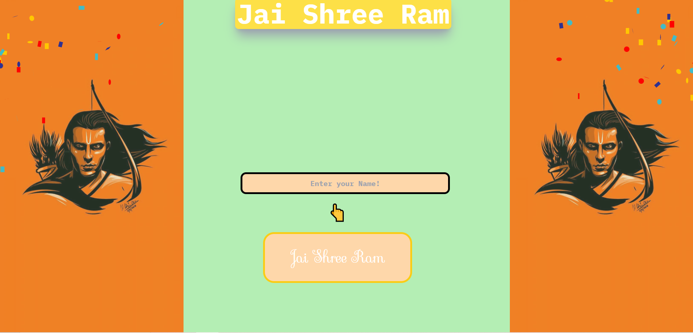

# Jai Shree Ram

## On the victorious occasion of Lord Rama's Homecoming.....
 > This is a project dedicated in the holy feet of Prabhu Ram!

---

### Shots 




---

## Installation

### Prerequisites

Make sure you have Node.js and npm installed on your machine.

### Clone the Repository

```bash
git clone https://github.com/YourUsername/YourProject.git


### Go to the directory
cd directory

### Run the project
```bash
npm run dev
